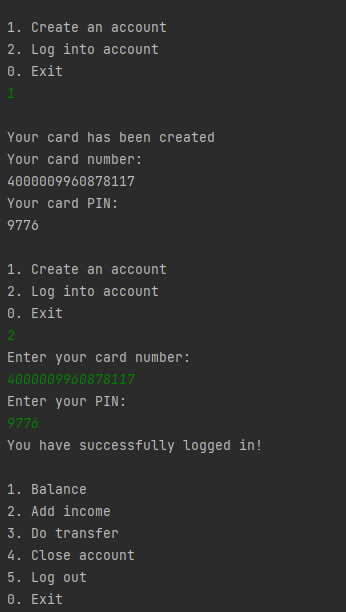
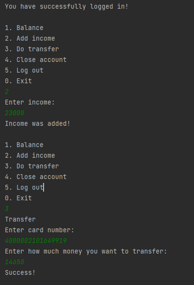

# Simple Banking System

Basic project focussing on developing a simple banking system. Intoduction to SQL and use of SQLite3. Implementation of
Luhn alogorithm to validate card numbers.

## Usage

The app is started by running the main() method on the Main class. This should take two arguments.
e.g `-fileName db.s3db`

```java
package banking;

public class Main {

    public static void main(String[] args) throws Exception {
        String dbPath = args[1];
        App app = new App(dbPath);
        app.run();
    }
}
```

## SQLite and JDBC

This project makes use of SQLite. A database embedded within the code itself. The file format is cross-platform, thus
can be copied and used on a different machine with different architecture.

```xml
<dependency>
    <groupId>org.xerial</groupId>
    <artifactId>sqlite-jdbc</artifactId>
    <version>3.36.0.3</version>
</dependency>
```

## Screenshots

### Account creation and login



### Depositing money and making a bank transfer



Com

